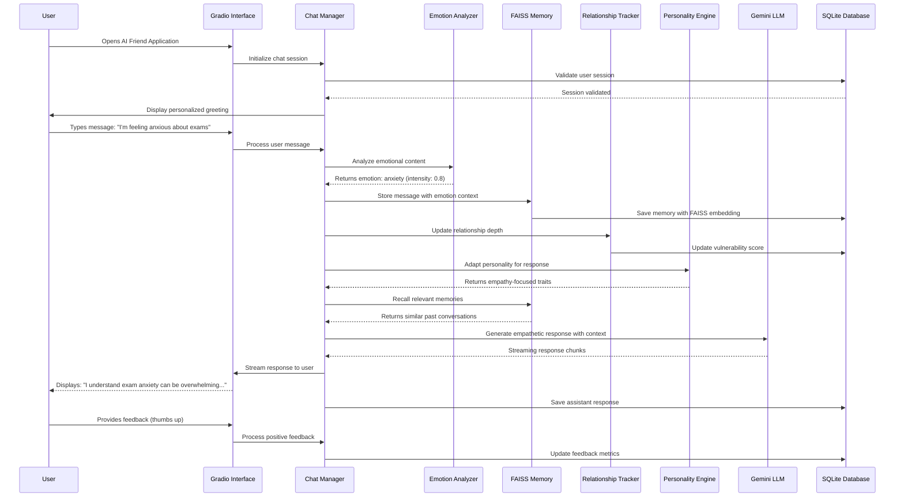

# Gen AI Exchange Hackathon Submission

**Hackathon Name:** Gen AI Exchange Hackathon  
**Team Name:** DisruptorDistrict  
**Challenge:** [Student] Generative AI for Youth Mental Wellness  
**Project:** AI Friend - Empathetic Mental Wellness Companion

---

## Problem Statement

Youth mental health faces a critical crisis with stigma, accessibility barriers, and lack of personalized support being the primary obstacles. Traditional mental health resources often feel clinical, intimidating, or judgmental, preventing young people from seeking help when they need it most. The core problems this solution addresses are:

1. **Stigma Barrier**: Fear of judgment prevents youth from seeking mental health support
2. **Accessibility Gap**: Limited access to affordable, immediate mental health resources
3. **Impersonal Support**: Generic advice that doesn't account for individual emotional patterns and needs
4. **Early Intervention Gap**: Lack of systems that can identify and respond to mental health concerns before they escalate
5. **Relationship Building**: Need for consistent, empathetic support that builds trust over time

The solution recognizes that youth need a "safe first step" - a non-judgmental, confidential space where they can express themselves freely and receive personalized, empathetic support that gradually builds their confidence to seek additional help when needed.

## Brief about the prototype

AI Friend is an advanced conversational AI companion specifically designed for youth mental wellness. The prototype leverages Google's Gemini AI with sophisticated emotion analysis, memory systems, and relationship management to provide personalized, empathetic support.

**User Journey:**
1. **Anonymous Registration**: Users create accounts with minimal personal information, ensuring privacy and reducing barriers to entry
2. **Empathetic Onboarding**: The AI (Mandy) introduces herself as a caring friend, not a therapist, establishing a comfortable, non-clinical environment
3. **Adaptive Conversations**: Through natural dialogue, the system analyzes emotions using transformer models (`joeddav/distilbert-base-uncased-go-emotions-student`), tracks interests, and builds personalized memories using FAISS vector similarity search
4. **Relationship Evolution**: The system tracks relationship depth through vulnerability scoring, progressing from "acquaintance" to "close friend" stages, adapting communication style accordingly
5. **Proactive Support**: Based on emotional patterns and interests, the AI proactively shares relevant content, coping strategies, and gentle encouragement
6. **Crisis Detection**: Advanced emotion analysis identifies concerning patterns and can guide users toward professional resources when needed

The prototype combines cutting-edge NLP with human-centered design, creating an experience that feels like chatting with an understanding friend rather than interacting with a clinical tool.

## Opportunity & Differentiators

### How is it different from existing solutions?

**1. Advanced Emotional Intelligence Architecture:**
- Implements dual-model emotion analysis using DistilBERT for emotion classification and RoBERTa for sentiment analysis
- Features a sophisticated vulnerability scoring system that identifies when users are sharing personal struggles
- Uses transformer-based empathy response generation rather than rule-based templates

**2. Relationship-Aware Personality Adaptation:**
- Unique relationship depth tracking system that evolves from "acquaintance" to "close friend" based on user vulnerability and engagement
- Adaptive personality engine that adjusts warmth, humor, empathy, and formality levels based on individual user preferences
- Time-awareness system that remembers conversation patterns and adjusts greetings based on user habits

**3. FAISS-Powered Contextual Memory:**
- Advanced memory consolidation system using Facebook AI Similarity Search (FAISS) for semantic memory retrieval
- Importance scoring algorithm that prioritizes emotionally significant conversations and personal insights
- Long-term memory promotion system that preserves crucial user information across sessions

**4. Intelligent Interest Integration:**
- Proactive content sharing system that learns user interests across 12 categories (health, entertainment, sports, etc.)
- YouTube content integration with transcript analysis and natural conversation hooks
- Engagement tracking that adapts content strategy based on user responses

### How will it be able to solve the problem?

**Feature → Benefit Mapping:**

**Anonymous User System** → Eliminates stigma by ensuring no personally identifiable information is required, allowing youth to seek help without fear of judgment or social consequences.

**Advanced Emotion Analysis** → Provides immediate emotional validation and appropriate responses, helping users feel heard and understood in moments of distress.

**Relationship Depth Tracking** → Builds genuine connection over time, creating the trust necessary for youth to open up about deeper mental health concerns.

**Contextual Memory with FAISS** → Remembers important details about user's life, struggles, and progress, providing continuity that makes conversations feel authentic and supportive.

**Adaptive Personality Engine** → Personalizes communication style to match user preferences, ensuring the support feels natural and comfortable rather than robotic.

**Proactive Interest Sharing** → Introduces positive content and coping strategies naturally within conversations, providing mental health benefits without feeling preachy or clinical.

**Time-Aware Conversation Management** → Recognizes user patterns and provides appropriate support based on timing, frequency, and duration of interactions.

### USP of the proposed solution

**Empathetic AI with Genuine Relationship Building**: The solution's unique selling proposition lies in its sophisticated relationship evolution system combined with advanced emotional intelligence. Unlike chatbots that treat each conversation independently, AI Friend builds genuine, long-term relationships through its vulnerability-aware memory system and adaptive personality engine. The system doesn't just respond to what users say—it remembers how they felt, learns their communication style, and evolves its personality to match their needs. This creates an unprecedented level of emotional connection that bridges the gap between automated support and human empathy, providing youth with a consistent, judgment-free companion that grows with them on their mental wellness journey.

## List of features offered by the solution

**1. Advanced Emotion Analysis System**
Implements dual transformer models (DistilBERT for emotions, RoBERTa for sentiment) to analyze user messages for 28 different emotions with intensity scoring. The `AdvancedEmotionAnalyzer` class provides comprehensive emotional understanding and generates appropriate empathy responses.

**2. FAISS-Powered Contextual Memory**
Uses Facebook AI Similarity Search to store and retrieve semantically relevant memories. The `FAISSMemoryManager` creates embeddings using SentenceTransformers and implements importance scoring based on emotional intensity, vulnerability, and personal significance.

**3. Relationship Depth Tracking**
The `RelationshipManager` tracks relationship evolution through four stages (acquaintance → casual friend → friend → close friend) based on vulnerability scores, interaction frequency, and reciprocity signals, adapting communication style accordingly.

**4. Adaptive Personality Engine**
Dynamically adjusts AI personality traits (warmth, humor, empathy, curiosity, formality) based on user interactions. The `PersonalityEngine` maintains baseline traits while adapting to individual user preferences and relationship stages.

**5. Intelligent Interest Tracking**
Automatically detects and tracks user interests across 12 categories using keyword analysis and context extraction. The `IntelligentInterestTracker` builds confidence scores and engagement levels for personalized content recommendations.

**6. Time-Aware Conversation Management**
The `TimeAwarenessManager` tracks conversation patterns, session durations, and user habits to provide contextually appropriate greetings and responses based on time gaps and usual chat times.

**7. YouTube Content Integration**
Fetches relevant YouTube content based on user interests, processes video transcripts with Gemini for key insights, and naturally introduces content during conversations with engagement tracking.

**8. Response Humanization System**
The `ResponseHumanizer` adds natural language variations, regional flavor, and relationship-appropriate adjustments to make AI responses feel more human and less robotic.

**9. Festival and Cultural Awareness**
Tracks Indian festivals and cultural events through the `FestivalTracker`, providing culturally relevant greetings and conversation topics.

**10. Rate Limiting and Safety**
Implements conversation rate limiting to prevent abuse while maintaining natural conversation flow, with safety measures for crisis detection and appropriate resource referrals.

**11. Secure User Authentication**
Uses bcrypt password hashing and session management through the `AuthenticationManager` to ensure user data security while maintaining anonymity options.

**12. Comprehensive Feedback System**
Collects user feedback on AI responses across multiple dimensions (general, humor, empathy, memory) to continuously improve the system's performance and user satisfaction.

## Process flow diagram or Use-case diagram (Textual Description)

**Primary User Flow:**
1. **Session Initialization**: User accesses application → Authentication validation → Personalized greeting generation
2. **Message Processing**: User input → Emotion analysis → Memory storage with embeddings → Relationship depth update
3. **Context Building**: Memory recall → Personality adaptation → Cultural/time context integration
4. **Response Generation**: Gemini API call with enriched context → Response humanization → Streaming delivery
5. **Feedback Loop**: User feedback collection → System learning → Personality/memory adjustments
6. **Continuous Learning**: Interest tracking → Content recommendations → Relationship evolution

## Architecture diagram of the proposed solution (Textual Description)

**System Architecture Components:**

**Frontend Layer:**
- **Gradio Interface**: Python-based web UI framework providing real-time chat interface with streaming responses, feedback buttons, and user authentication forms. Deployed as a web application accessible via browser.

**Application Layer:**
- **Chat Manager**: Central orchestration service handling message processing, context building, and response coordination
- **Authentication Manager**: Secure user management with bcrypt password hashing and session validation
- **Feature Managers**: Modular services including EmotionAnalyzer, RelationshipManager, PersonalityEngine, InterestTracker, and TimeAwarenessManager

**AI/ML Layer:**
- **Google Gemini API**: Primary LLM for response generation and content processing via REST API calls
- **Transformer Models**: Local DistilBERT (emotion classification) and RoBERTa (sentiment analysis) models
- **SentenceTransformers**: all-MiniLM-L6-v2 model for generating embeddings for memory storage
- **FAISS Vector Database**: Facebook AI Similarity Search for semantic memory retrieval and similarity matching

**Data Layer:**
- **SQLite Database**: Stores user profiles, chat history, memories, feedback, and relationship data with optimized indices
- **Memory Storage**: FAISS indices for vector similarity search combined with SQLite for metadata
- **Content Cache**: YouTube video data and processed transcripts stored locally

**External Services:**
- **YouTube RSS Feeds**: Content fetching for interest-based recommendations
- **Google Search API**: News and trending topic discovery (optional)
- **NLTK Data**: Natural language processing resources for text analysis

**Data Flow Architecture:**
1. **Input Processing**: User message → Emotion analysis → Interest extraction → Memory encoding
2. **Context Assembly**: Memory retrieval → Relationship context → Personality parameters → Cultural context
3. **Response Generation**: Gemini API → Response humanization → Streaming delivery
4. **Learning Loop**: Feedback processing → Relationship updates → Memory consolidation → Interest adaptation

**Deployment Architecture:**
- **Containerized Deployment**: Docker containers with health checks and volume persistence
- **Local Development**: Python virtual environment with all dependencies
- **Production Ready**: Docker Compose orchestration with environment variable management

## Technologies to be used in the solution

**Frontend:**
- **Gradio 4.31.0**: Modern Python web framework for ML applications with real-time streaming chat interface
- **HTML/CSS/JavaScript**: Underlying web technologies managed by Gradio framework

**Backend:**
- **Python 3.11**: Core programming language with async/await support
- **SQLite**: Embedded database for user data, conversations, and memory storage
- **bcrypt 4.1.3**: Secure password hashing and authentication
- **python-dotenv 1.0.1**: Environment variable management for configuration

**AI/ML Stack:**
- **Google Generative AI 0.3.2**: Gemini 1.5 Flash model for conversational AI and content processing
- **Transformers 4.35.2**: Hugging Face library for emotion analysis models (DistilBERT, RoBERTa)
- **Sentence Transformers 2.2.2**: Semantic embedding generation for memory system
- **PyTorch 2.1.1**: Deep learning framework supporting transformer models
- **FAISS-CPU 1.7.4**: Facebook AI Similarity Search for vector database operations
- **NLTK 3.8.1**: Natural language processing toolkit for text analysis
- **NumPy 1.26.4**: Numerical computing for vector operations and similarity calculations

**DevOps/Infrastructure:**
- **Docker**: Containerization with multi-stage builds and health checks
- **Docker Compose**: Service orchestration for development and deployment
- **GitHub Actions**: CI/CD pipeline for automated testing and deployment (configured)
- **Logging**: Structured logging with rotation and error tracking

**Additional Libraries:**
- **Requests 2.31.0**: HTTP client for external API calls and content fetching
- **Tenacity 8.2.3**: Retry logic for robust API interactions
- **Feedparser**: RSS feed processing for YouTube content integration
- **BeautifulSoup4**: Web scraping for content extraction and processing
- **Schedule**: Task scheduling for periodic content updates and memory consolidation

**Testing Framework:**
- **Pytest 7.4.3**: Unit testing framework with fixtures and mocking
- **Pytest-cov 4.1.0**: Code coverage analysis for quality assurance

**Security & Compliance:**
- **itsdangerous 2.1.2**: Secure token generation and session management
- **Input Validation**: Comprehensive sanitization and validation throughout the application
- **Rate Limiting**: Conversation rate limiting to prevent abuse
- **Data Privacy**: Anonymous user options and secure data handling practices

This technology stack provides a robust, scalable, and secure foundation for delivering empathetic AI-powered mental wellness support to youth, combining cutting-edge AI capabilities with production-ready infrastructure and security practices.
